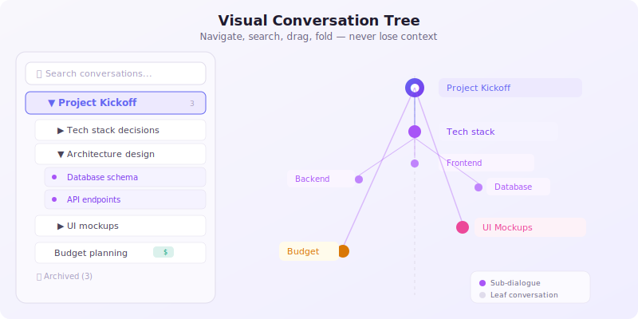
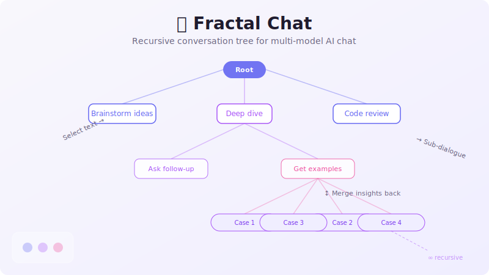

<div align="center">

# 🌿 Fractal Chat

**递归对话树 + 多模型 AI 聊天**

> 选择任意文本 → 创建聚焦的子对话 → 在 GPT-4o、Claude、DeepSeek 之间并排对比答案。

[](LICENSE)
[](https://www.typescriptlang.org/)
[](https://react.dev/)
[](https://vitejs.dev/)

</div>

---

## ✨ 功能特性

### 🧬 递归子对话树
选中回复中的任意内容 → 右键 → 创建一个聚焦的子对话。每个子对话都是一条新分支，可以继续深入挖掘，然后将结果合并回父对话。


### 🔄 多模型并行对比
将同一问题同时发送给多个 LLM，实时并排观看回复流式输出。不再需要在标签页之间手动复制粘贴。


### 🌲 可视化对话树
以交互式树状图浏览整个对话历史。折叠、展开、搜索、拖拽排序——你的上下文永远不会丢失。

- **全文搜索** 所有消息内容
- **拖拽排序** 调整对话顺序
- **折叠/展开** 保持专注
- **右键菜单** 快速操作



### 🏷️ 整理与导出
- **标签** 和 **归档** 管理对话
- **导出** 单个对话或整棵树为 Markdown / JSON
- **跨对话 @引用** — 链接到任意对话

### ✏️ 编辑与版本
- **消息编辑** 附带版本历史
- **"已编辑"时间戳** 保持透明
- **合并撤销** — 一键回退子对话合并

---

## 🚀 快速开始

```bash
git clone https://github.com/LeoLiao0806Xuan/Fractal_Chat.git
cd fractal-chat
npm install
npm run dev
```

打开 `http://localhost:5173` — 无需后端、无需数据库、无需注册。

### 配置模型

1. 点击输入栏的 ⚙️
2. 添加 API 地址（OpenAI / Anthropic / DeepSeek / 任意兼容 OpenAI 的 API）
3. 输入你的 API 密钥（浏览器内 AES-256-GCM 加密存储）
4. 开始聊天！

> **💡 提示：** 添加多个模型后点击 **⊕ 对比** — 选择要对比的模型，一次发送给所有模型同时回复。

---

## 🖼️ 截图

| 对话树 | 多模型对比 |
|---|---|
|  |  |

| 子对话流程 | 架构概览 |
|---|---|
|  |  |

---

## 🏗️ 架构

Fractal Chat 是 **纯客户端** 应用。没有后端、没有用户账户、没有任何数据离开你的浏览器——除非发送到你配置的 LLM API。

```
┌──────────────────────────────────────┐
│          React 19 + TypeScript        │
│  ┌─────────┐  ┌───────────────────┐  │
│  │ 对话树   │  │  聊天输入         │  │
│  │ (递归)   │  │  + 模型选择器     │  │
│  └────┬────┘  └────────┬──────────┘  │
│       │                │             │
│  ┌────▼────────────────▼──────────┐  │
│  │         Zustand 状态管理       │  │
│  │  dialogStore · modelStore      │  │
│  └────────────┬───────────────────┘  │
│       │                │             │
│  ┌────▼────┐   ┌──────▼────────┐   │
│  │IndexedDB│   │  API 层       │   │
│  │ (idb)   │   │ callModel()   │   │
│  │ 持久化   │   │ OAI/Anthropic │   │
│  └─────────┘   └──────┬────────┘   │
│                       │            │
│              ┌────────▼────────┐   │
│              │  LLM 提供商     │   │
│              │  (你的 API 密钥) │   │
│              └─────────────────┘   │
└──────────────────────────────────────┘
```

### 关键技术选型

| 选择 | 理由 |
|--------|------|
| **纯客户端** | 零运维、零成本、完全隐私 |
| **IndexedDB** (idb) | 刷新不丢数据，无需服务器 |
| **Zustand** | 轻量级状态管理，无模板代码 |
| **Tiptap** | 富文本渲染，支持 Markdown |
| **AES-256-GCM** | API 密钥加密后存储 |

---

## 🧪 测试

```bash
npm test        # 运行测试 (Vitest)
npm run build   # 类型检查 + 生产构建
```

当前：**24 个测试**，覆盖 modelStore、dialogStore、mergeUtils——全部通过。

---

## 🗺️ 路线图

- [x] Phase 0 — 原型：API 统一、持久化、错误边界
- [x] Phase 1 — MVP：子对话、树导航、搜索、导出、标签
- [x] 多模型并行对比
- [ ] Phase 2 — 核心差异化
  - [ ] 实时协作 (Yjs)
  - [ ] 移动端适配
  - [ ] 虚拟滚动（长对话）
  - [ ] 消息级自动标签
- [ ] 社区
  - [ ] GitHub Discussions
  - [ ] 国际化 (i18n)
  - [ ] 插件系统

---

## 🤝 贡献指南

欢迎贡献代码！随时提 Issue 或提交 PR。

1. Fork 本仓库
2. 创建功能分支 (`git checkout -b feature/amazing`)
3. 提交你的修改 (`git commit -m 'Add amazing feature'`)
4. 推送 (`git push origin feature/amazing`)
5. 发起 Pull Request

详见 [CONTRIBUTING.md](CONTRIBUTING.md)。

---

## 📄 许可证

[Apache 2.0](LICENSE) — 个人和商业使用免费。

---

<div align="center">

**为经常和 AI 聊天的人而建 ❤️**

</div>
